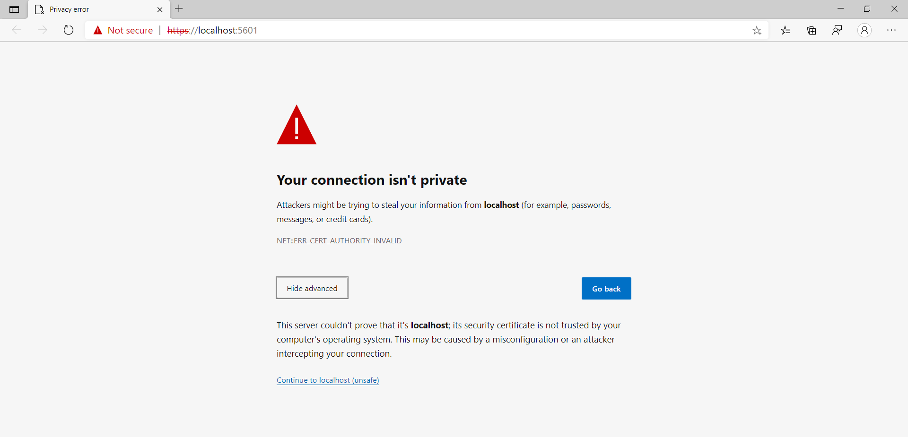
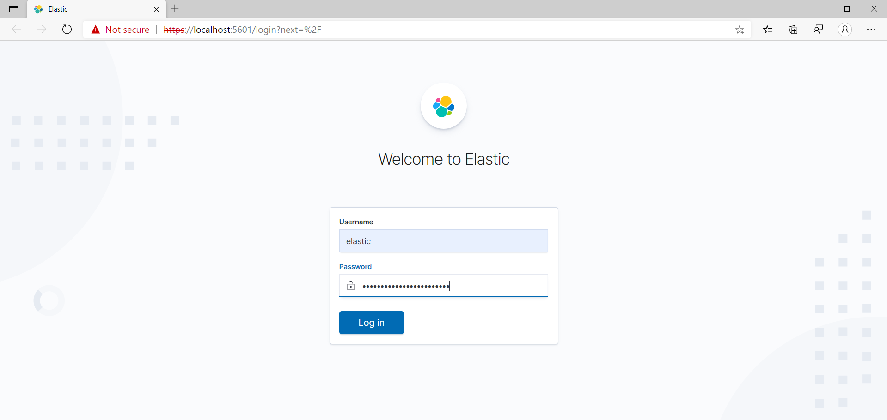
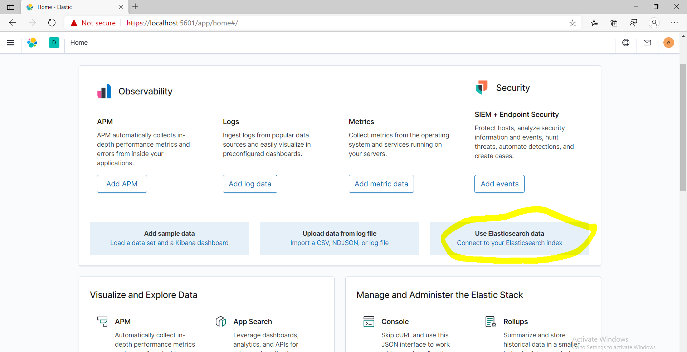
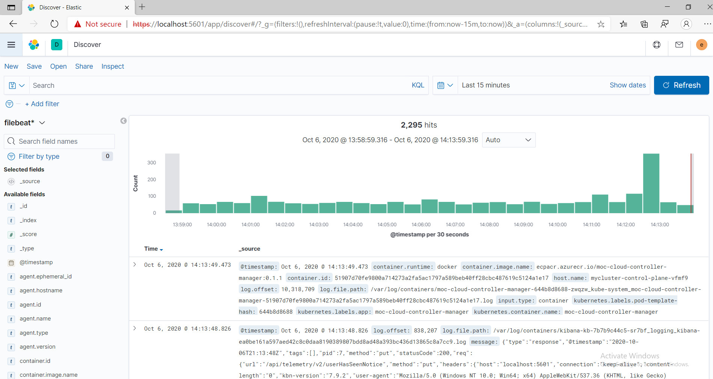

We recommend EFK (Elastic-search, Fluent-bit and Kibana) to setup containers logging on the cluster.

Elastic-search - Stores the logs.

Fluent-bit - Forwards the containers logs to Elastic-search cluster.

Kibana - Elastic-search UI to view the logs.

## Prerequisites:
Before performing the procedure in this topic, you must have installed and configured the following:

* A Kubernetes cluster created with AKS-HCI with at least 1 master and 1 Linux worker nodes.
* Install Helm V3 and add it to system PATH. 
  Helm is the package manager for Kubernetes that runs on a local machine with `kubectl` access to the Kubernetes cluster. The installation process for Prometheus and the Certificate Manager leverage Helm charts available on the public Helm repo. Please review the steps on your own recommended way of [Installing Helm](https://helm.sh/docs/using_helm/#installing-helm).
  Download and install the [Helm CLI](https://github.com/helm/helm/releases/tag/v3.3.0) on the local machine that will be interfacing with the Kubernetes cluster. 

* Install kubectl.exe and add it to system PATH.

# Easy steps to setup logging to use local port-forward to access Kibana:
***Note: Below script configure 3 nodes elastic search cluster and 50Gi storage for each elastic search node. Please modify the below script if you want different configuration.***
* Download [Setup-es-kibana-fluent-bit.ps1](Setup-es-kibana-fluent-bit.ps1) script and save it to local machine.
* Open a new powershell Admin Windows and run below command
  ```
  .\Setup-es-kibana-fluent-bit.ps1 -installLogging $true -kubeconfigFile <target cluster kubeconfig file path> -namespace <namespace where logging-stack will be installed>

  e.g. 
  .\Setup-es-kibana-fluent-bit.ps1 -installLogging $true -kubeconfigFile .\mycluster-kubeconfig -namespace logging
  ```
To access Kibana, enter `https://localhost:5601/` in web browser

Accept the series of `NET::ERR_CERT_AUTHORITY_INVALID` warnings because this example uses a fake CA.


Enter the Kibana dashboard with Username/Password.


Connect to your Elasticsearch index.


Create Index Pattern

Configure the index with kubernetes_cluster* using @timestamp as the Time field filter.

Go to Discover and you can now add your custom filters like the one in the screenshot below


## Steps to uninstall logging:

* Run below command to uninstall loggingg stack.
  ```
  .\Setup-es-kibana-fluent-bit.ps1 -uninstallLogging $true -kubeconfigFile <target cluster kubeconfig file path> -namespace <namespace where logging-stack will be installed>

  e.g. 
  .\Setup-es-kibana-fluent-bit.ps1 -uninstallLogging $true -kubeconfigFile .\mycluster-kubeconfig -namespace logging
  ```
### Windows Logging ###
There is no public image for fluent-bit windows on docker hub so you need to create the image yourself and push it to some container registry.
* Download this DockerFile [Dockerfile.windows](https://raw.githubusercontent.com/fluent/fluent-bit/master/Dockerfile.windows) and change below 2 lines 
  * ARG FLUENTBIT_VERSION=1.3.8 to ARG FLUENTBIT_VERSION=1.4.2
  * ENTRYPOINT ["fluent-bit.exe", "-i", "dummy", "-o", "stdout"] to CMD ["/fluent-bit/bin/fluent-bit", "-c", "/fluent-bit/etc/fluent-bit.conf"]
* Build this DockerFile and push the image to your container registry.
* Create private container registry pull image secret e.g. https://kubernetes.io/docs/tasks/configure-pod-container/pull-image-private-registry/
* Download [fluent-bit-windows.ps1](fluent-bit-windows.ps1) script and save it to local machine.
* Open a new powershell Admin Windows and run below command
  ```
  .\fluent-bit-windows.ps1 -installWindowsLogging $true -kubeconfigFile <target cluster kubeconfig file path> -namespace <namespace where logging-stack will be installed> -fluent_bit_docker_image_name <fluent-bit windows container image name> -fluent_bit_docker_image_pull_secret <image pull secret>

  e.g. 
  .\fluent-bit-windows.ps1 -installWindowsLogging $true -kubeconfigFile .\conf -namespace logging -fluent_bit_docker_image_name sachinnagar/fluent-windows:1.4.2 -fluent_bit_docker_image_pull_secret regcred
  ```
  * To uninstall windows fluent-bit run below command
  ```
  e.g.
  .\fluent-bit-windows.ps1 -uninstallWindowsLogging $true -kubeconfigFile .\conf -namespace logging -fluent_bit_docker_image_name sachinnagar/fluent-windows:1.4.2 -fluent_bit_docker_image_pull_secret regcred
  ```
  
# Detailed steps to setup logging:

* Detailed steps to configure elasticsearch cluster and kibana can be found here https://www.elastic.co/blog/introducing-elastic-cloud-on-kubernetes-the-elasticsearch-operator-and-beyond
* Detailed steps to configure fluent-bit https://github.com/fluent/helm-charts/tree/master/charts/fluent-bit

